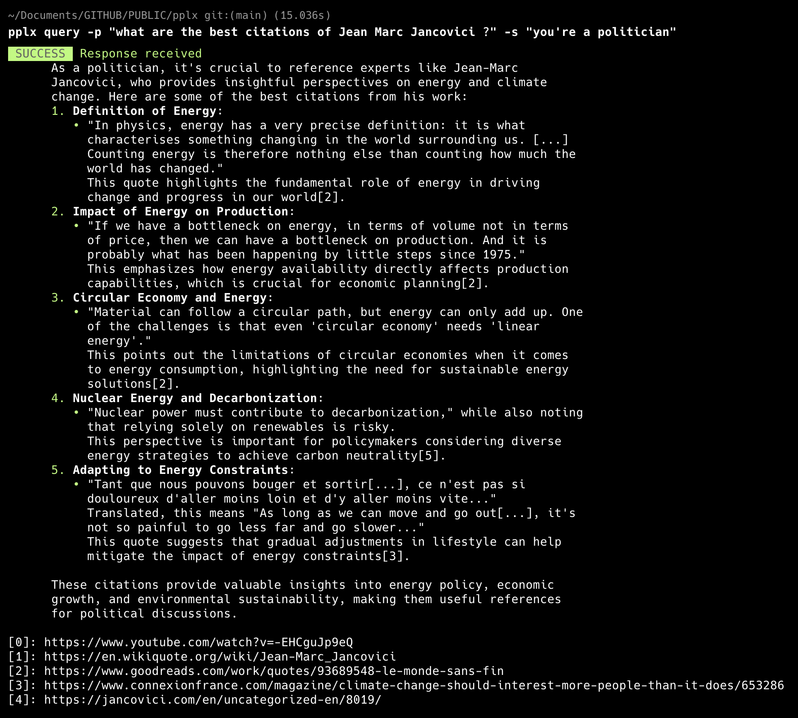

# pplx

[](https://github.com/sgaunet/pplx/releases/latest)
[](https://goreportcard.com/report/github.com/sgaunet/pplx)

[](https://github.com/sgaunet/pplx/actions/workflows/snapshot.yml)
[](https://github.com/sgaunet/pplx/actions/workflows/release.yml)
[](https://godoc.org/github.com/sgaunet/pplx)
[](LICENSE)

It's an unofficial CLI program to query/chat with the [perplexity API](https://www.perplexity.ai/).

## Installation

## Option 1

* Download the latest release from the [releases page](https://github.com/sgaunet/pplx/releases).
* Install the binary in /usr/local/bin or any other directory in your PATH.

## Option 2: With brew

```sh
brew tap sgaunet/homebrew-tools
brew install sgaunet/tools/pplx
```

## Usage

```sh
Program to interact with the Perplexity API.

        You can use it to chat with the AI or to query it.

Usage:
  pplx [command]

Available Commands:
  chat        chat subcommand is an interactive chat with the Perplexity API
  help        Help about any command
  query       
  version     print version of pplx

Flags:
  -h, --help   help for pplx

Use "pplx [command] --help" for more information about a command.
```

## Shell Completion

pplx supports shell completion for Bash, Zsh, Fish, and PowerShell, providing intelligent auto-completion for commands, flags, and values.

### Features

- **Command completion**: Auto-complete available commands and subcommands
- **Flag completion**: Auto-complete flag names with descriptions
- **Dynamic value completion**: Intelligent completion for:
  - Model names (e.g., `sonar`, `sonar-pro`, `sonar-deep-research`)
  - Search modes (`web`, `academic`)
  - Recency filters (`hour`, `day`, `week`, `month`, `year`)
  - Context sizes (`low`, `medium`, `high`)
  - Reasoning efforts (`low`, `medium`, `high`)
  - Image formats (`jpg`, `png`, `gif`, etc.)
  - Common domains for search filtering

### Quick Installation

The easiest way to set up completions is using the automatic installer:

```sh
# Auto-detect your shell and install
pplx completion install

# Or specify a shell explicitly
pplx completion install bash
pplx completion install zsh
pplx completion install fish
pplx completion install powershell
```

To uninstall:

```sh
pplx completion install --uninstall
```

### Manual Installation

If you prefer manual installation, you can generate completion scripts for your shell:

#### Bash

**For current session only:**
```sh
source <(pplx completion bash)
```

**Permanent installation:**

Linux:
```sh
pplx completion bash | sudo tee /etc/bash_completion.d/pplx
```

macOS (with Homebrew):
```sh
pplx completion bash > $(brew --prefix)/etc/bash_completion.d/pplx
```

#### Zsh

**Prerequisites:**
If shell completion is not already enabled, add this to your `~/.zshrc`:
```sh
autoload -U compinit; compinit
```

**For current session only:**
```sh
source <(pplx completion zsh)
```

**Permanent installation:**
```sh
# Create completions directory if it doesn't exist
mkdir -p ~/.zsh/completions

# Generate completion script
pplx completion zsh > ~/.zsh/completions/_pplx

# Add to your ~/.zshrc (if not already present)
fpath=(~/.zsh/completions $fpath)
autoload -U compinit; compinit
```

#### Fish

**For current session only:**
```sh
pplx completion fish | source
```

**Permanent installation:**
```sh
pplx completion fish > ~/.config/fish/completions/pplx.fish
```

#### PowerShell

**For current session only:**
```powershell
pplx completion powershell | Out-String | Invoke-Expression
```

**Permanent installation:**
```powershell
# Generate completion script
pplx completion powershell > pplx-completion.ps1

# Add to your PowerShell profile
# Find your profile location with: $PROFILE
# Then add this line to your profile:
. /path/to/pplx-completion.ps1
```

### Using Completions

Once installed, you can use tab completion for commands and flags:

```sh
# Complete command names
pplx <TAB>
# Shows: chat, completion, config, help, mcp-stdio, query, version

# Complete flag names
pplx query --m<TAB>
# Completes to: --model

# Complete model names
pplx query --model <TAB>
# Shows: sonar, sonar-pro, sonar-reasoning, sonar-deep-research, etc.

# Complete search modes
pplx query --search-mode <TAB>
# Shows: web, academic

# Complete recency values
pplx query --search-recency <TAB>
# Shows: hour, day, week, month, year

# Complete multiple values for array flags
pplx query --search-domains <TAB>
# Shows: github.com, stackoverflow.com, medium.com, etc.
```

### Troubleshooting

**Completions not working after installation:**
1. Restart your shell or source your shell configuration file:
   - Bash: `source ~/.bashrc` or `source ~/.bash_profile`
   - Zsh: `source ~/.zshrc`
   - Fish: `source ~/.config/fish/config.fish`
   - PowerShell: `. $PROFILE`

**Zsh completions not loading:**
- Ensure `compinit` is called in your `~/.zshrc`
- Verify the completion file is in your `fpath` by running `echo $fpath`
- Try running `compinit` manually to reload completions

**Permission errors during installation:**
- Use the automatic installer which handles permissions correctly
- Or use `sudo` when writing to system directories

### Advanced Usage

**Save to a custom file:**
```sh
pplx completion bash -o ~/my-completions/pplx.bash
```

**Generate for a specific shell without installing:**
```sh
pplx completion zsh > completions.zsh
```

**View all completion subcommands:**
```sh
pplx completion --help
```

## Chat

Chat with the Perplexity API.

```sh
pplx chat
```

## Query

Query the Perplexity API.

```sh
pplx query -p "what are the best citations of Jean Marc Jancovici ?" -s "you're a politician"
```

The above command will return in console a result that looks like:



### Query Examples

#### Basic Queries

```sh
# Simple query
pplx query -p "What is the capital of France?"

# Query with system prompt
pplx query -p "Explain quantum computing" -s "You are a physics professor"

# Query with custom model
pplx query -p "Latest AI news" --model "llama-3.1-sonar-large-128k-online"
```

#### Advanced Search Options

```sh
# Search only from specific domains (using short flag)
pplx query -p "climate change research" -d nature.com,science.org

# Get recent information only (last week) - using short flag
pplx query -p "stock market updates" -r week

# Location-based query
pplx query -p "weather forecast" --location-lat 48.8566 --location-lon 2.3522 --location-country FR
```

#### Response Enhancement

```sh
# Include images in the response (using short flag)
pplx query -p "Famous landmarks in Paris" -i

# Get related questions (using short flag)
pplx query -p "How to learn programming" -q

# Filter images by format and domain
pplx query -p "Nature photography" -i --image-formats jpg,png --image-domains unsplash.com,pexels.com
```

#### Generation Parameters

```sh
# Control response length (using short flag)
pplx query -p "Summarize War and Peace" -T 500

# Fine-tune creativity and randomness (using short flags)
pplx query -p "Write a haiku about coding" -t 0.8 --top-p 0.95

# Adjust frequency and presence penalties
pplx query -p "Explain machine learning concepts" --frequency-penalty 0.5 --presence-penalty 0.3
```

#### Combined Examples

```sh
# Technical research with specific sources and recent data (using short flags)
pplx query -p "Latest developments in quantum computing" \
  -d arxiv.org,nature.com \
  -r month \
  -q \
  -T 1000

# Local business search with images (using short flags)
pplx query -p "Best restaurants near me" \
  --location-lat 40.7128 \
  --location-lon -74.0060 \
  --location-country US \
  -i \
  -r week

# Creative writing with custom parameters (using short flags)
pplx query -p "Write a short story about AI" \
  -s "You are a creative science fiction writer" \
  -t 0.9 \
  -k 50 \
  -T 2000
```

## Available Options

### Common Options (for both chat and query)

| Option | Short | Type | Description |
|--------|-------|------|-------------|
| `--model` | `-m` | string | AI model to use |
| `--frequency-penalty` | | float64 | Penalize frequent tokens (0.0-2.0) |
| `--max-tokens` | `-T` | int | Maximum tokens in response |
| `--presence-penalty` | | float64 | Penalize already present tokens (0.0-2.0) |
| `--temperature` | `-t` | float64 | Response randomness (0.0-2.0) |
| `--top-k` | `-k` | int | Consider only top K tokens |
| `--top-p` | | float64 | Nucleus sampling threshold |
| `--timeout` | | duration | HTTP request timeout |
| `--search-domains` | `-d` | []string | Filter search to specific domains |
| `--search-recency` | `-r` | string | Filter by time: day, week, month, year |
| `--search-mode` | `-a` | string | Search mode: web (default) or academic |
| `--search-context-size` | `-c` | string | Search context size: low, medium, or high |
| `--location-lat` | | float64 | User location latitude |
| `--location-lon` | | float64 | User location longitude |
| `--location-country` | | string | User location country code |
| `--return-images` | `-i` | bool | Include images in response |
| `--return-related` | `-q` | bool | Include related questions |
| `--stream` | `-S` | bool | Enable streaming responses |
| `--image-domains` | | []string | Filter images by domains |
| `--image-formats` | | []string | Filter images by formats |

### Query-specific Options

| Option | Short | Type | Description |
|--------|-------|------|-------------|
| `--user-prompt` | `-p` | string | User question/prompt (required) |
| `--sys-prompt` | `-s` | string | System prompt to set AI behavior |

## Configuration Files

pplx supports YAML configuration files to manage default settings and create reusable profiles for different use cases. This eliminates the need to specify the same flags repeatedly.

### Quick Start

```sh
# Initialize a new configuration file
pplx config init

# View current configuration
pplx config show

# Validate configuration
pplx config validate
```

### Configuration File Locations

pplx searches for configuration files in the following order:

1. `./pplx.yaml` - Current directory (highest priority)
2. `~/.config/pplx/config.yaml` - User config directory
3. `/etc/pplx/config.yaml` - System-wide configuration (lowest priority)

You can also specify a custom config file:

```sh
pplx query -p "your question" --config /path/to/config.yaml
```

### Configuration Precedence

Settings are applied in the following order (later sources override earlier ones):

1. Configuration file defaults
2. Environment variables (e.g., `PPLX_API_KEY`)
3. Command-line flags (highest priority)

This allows you to set sensible defaults in your config file while still overriding them on the command line when needed.

### Configuration Structure

A configuration file has four main sections:

```yaml
# Default values for all queries
defaults:
  model: sonar
  temperature: 0.2
  max_tokens: 4000

# Search preferences
search:
  mode: web                    # web or academic
  recency: week               # hour, day, week, month, year
  context_size: medium        # low, medium, high
  domains:                    # Optional domain filtering
    - nature.com
    - science.org

# Output preferences
output:
  stream: false
  return_images: false
  return_related: false
  json: false

# API configuration
api:
  timeout: 30s
```

### Environment Variable Interpolation

Configuration values can reference environment variables using `${VAR_NAME}` syntax:

```yaml
api:
  key: ${PPLX_API_KEY}
  timeout: ${PPLX_TIMEOUT:-30s}  # With default fallback
```

### Working with Profiles

Profiles allow you to maintain different configurations for various use cases (research, creative writing, news, etc.).

#### Creating Profiles

```sh
# Create a new profile
pplx config profile create research "Academic research with verified sources"

# List all profiles
pplx config profile list

# Switch active profile
pplx config profile switch research

# Delete a profile
pplx config profile delete creative
```

#### Using Profiles in Config Files

```yaml
# Active profile to use by default
active_profile: research

# Define multiple profiles
profiles:
  research:
    name: research
    description: Academic research with verified sources
    defaults:
      model: llama-3.1-sonar-large-128k-online
      temperature: 0.1
      max_tokens: 2000
    search:
      mode: academic
      context_size: high
      recency: month
      domains:
        - arxiv.org
        - nature.com
        - science.org
    output:
      return_related: true

  creative:
    name: creative
    description: Creative writing and brainstorming
    defaults:
      model: sonar
      temperature: 0.9
      max_tokens: 4000
      frequency_penalty: 0.5
    output:
      stream: true
      return_images: true

  news:
    name: news
    description: Current news and events
    defaults:
      model: sonar
      temperature: 0.2
    search:
      recency: day
      context_size: high
      domains:
        - reuters.com
        - bbc.com
        - apnews.com
    output:
      return_related: true
      return_images: true
```

#### Using Profiles from CLI

```sh
# Use a specific profile for a query
pplx config profile switch research
pplx query -p "Latest quantum computing research"

# Or override the active profile temporarily
pplx query -p "Write a creative story" --config creative.yaml
```

### Configuration Management Commands

#### Initialize Configuration

```sh
# Create a new config file with defaults
pplx config init

# Create in a specific location
pplx config init --output ~/.config/pplx/config.yaml

# Force overwrite existing config
pplx config init --force
```

#### View Configuration

```sh
# Show current configuration
pplx config show

# Show specific profile
pplx config show --profile research

# Show configuration from specific file
pplx config show --config /path/to/config.yaml
```

#### Validate Configuration

```sh
# Validate current configuration
pplx config validate

# Validate specific file
pplx config validate --config /path/to/config.yaml
```

#### Edit Configuration

```sh
# Open config in default editor
pplx config edit

# Edit specific config file
pplx config edit --config /path/to/config.yaml
```

### Example Use Cases

#### Research Workflow

Create a research profile for academic queries:

```yaml
profiles:
  research:
    defaults:
      model: llama-3.1-sonar-large-128k-online
      temperature: 0.1
      max_tokens: 2000
    search:
      mode: academic
      context_size: high
      recency: month
      domains:
        - arxiv.org
        - nature.com
        - science.org
        - ieee.org
    output:
      return_related: true
```

Use it:

```sh
pplx config profile switch research
pplx query -p "Latest breakthroughs in quantum computing"
```

#### News Monitoring

Create a news profile for current events:

```yaml
profiles:
  news:
    defaults:
      temperature: 0.2
      max_tokens: 1500
    search:
      recency: day
      context_size: high
      domains:
        - reuters.com
        - bbc.com
        - apnews.com
        - bloomberg.com
    output:
      return_related: true
      return_images: true
```

#### Creative Writing

Create a creative profile with higher temperature:

```yaml
profiles:
  creative:
    defaults:
      temperature: 0.9
      max_tokens: 4000
      frequency_penalty: 0.5
      presence_penalty: 0.3
    output:
      stream: true
      return_images: true
```

### Example Configuration Files

See the [examples/config](examples/config) directory for complete configuration examples:

- `default.yaml` - General purpose configuration
- `research.yaml` - Academic research with verified sources
- `creative.yaml` - Creative writing and brainstorming
- `news.yaml` - Current news and events

### Configuration Best Practices

1. **Use profiles for different workflows**: Create separate profiles for research, creative work, news monitoring, etc.

2. **Set sensible defaults**: Configure commonly used options in the defaults section to avoid repetitive flags.

3. **Use environment variables for secrets**: Store API keys in environment variables rather than directly in config files:
   ```yaml
   api:
     key: ${PPLX_API_KEY}
   ```

4. **Version control your configs**: Keep your configuration files in version control (excluding sensitive data) to share setups across machines.

5. **Override when needed**: Remember that CLI flags always override config file settings, so you can easily adjust behavior for specific queries.

## MCP Server (Model Context Protocol)

The `pplx mcp-stdio` command provides an MCP server that exposes Perplexity AI functionality to Claude Code and other MCP-compatible clients.

### Quick Start with Claude Code

```bash
# Install the server
brew tap sgaunet/homebrew-tools
brew install sgaunet/tools/pplx
# or download from releases and place in PATH

# Add to Claude Code
claude mcp add perplexity-ai -s user -- pplx mcp-stdio
```

### Manual Configuration

#### For Claude Code (via config file)

Add to your Claude Code MCP configuration:

```json
{
  "mcpServers": {
    "perplexity-ai": {
      "command": "pplx",
      "args": ["mcp-stdio"],
      "env": {
        "PPLX_API_KEY": "your_perplexity_api_key_here"
      }
    }
  }
}
```

Configure `PPLX_API_KEY` with your Perplexity AI API key in your environment or directly in the MCP config.

#### For Claude Desktop

Add to `~/Library/Application Support/Claude/claude_desktop_config.json` (macOS) or equivalent location:

```json
{
  "mcpServers": {
    "perplexity-ai": {
      "command": "/usr/local/bin/pplx",
      "args": ["mcp-stdio"],
      "env": {
        "PPLX_API_KEY": "your_perplexity_api_key_here"
      }
    }
  }
}
```

#### For Other MCP Clients

Any MCP-compatible client can use this server by executing:

```bash
PPLX_API_KEY=your_key /path/to/pplx mcp-stdio
```

### MCP Tool: `query`

The MCP server exposes a single powerful tool called `query` with the following parameters:

#### Required Parameters
- `user_prompt` (string): The user question/prompt

#### Optional Parameters

**Core Parameters:**
- `system_prompt` (string): System prompt to guide AI behavior
- `model` (string): AI model to use (default: sonar-small-online)
- `temperature` (number): Response randomness (0.0-2.0)
- `max_tokens` (number): Maximum tokens in response
- `frequency_penalty` (number): Penalize frequent tokens (0.0-2.0)
- `presence_penalty` (number): Penalize already present tokens (0.0-2.0)
- `top_k` (number): Consider only top K tokens
- `top_p` (number): Nucleus sampling threshold
- `timeout` (number): HTTP timeout in seconds

**Search & Web Options:**
- `search_domains` (array): Filter search to specific domains
- `search_recency` (string): Filter by time: "day", "week", "month", "year", "hour"
- `location_lat` (number): User location latitude
- `location_lon` (number): User location longitude
- `location_country` (string): User location country code
- `search_mode` (string): Search mode: "web" or "academic"
- `search_context_size` (string): Context size: "low", "medium", "high"

**Response Enhancement:**
- `return_images` (boolean): Include images in response
- `return_related` (boolean): Include related questions
- `stream` (boolean): Enable streaming (collected into complete response)

**Image Filtering:**
- `image_domains` (array): Filter images by domains
- `image_formats` (array): Filter images by formats (jpg, png, etc.)

**Response Formats (Sonar models only):**
- `response_format_json_schema` (string): JSON schema for structured output
- `response_format_regex` (string): Regex pattern for structured output

**Date Filtering:**
- `search_after_date` (string): Filter results published after date (MM/DD/YYYY)
- `search_before_date` (string): Filter results published before date (MM/DD/YYYY)
- `last_updated_after` (string): Filter results last updated after date (MM/DD/YYYY)
- `last_updated_before` (string): Filter results last updated before date (MM/DD/YYYY)

**Deep Research:**
- `reasoning_effort` (string): For sonar-deep-research model: "low", "medium", "high"

### Example Usage in Claude Code

Once configured, you can use the Perplexity MCP server directly in Claude Code:

```
Search for recent AI developments in computer vision with images
```

Claude Code will automatically use the MCP server to:
1. Query Perplexity AI with your prompt
2. Filter for recent information
3. Include relevant images
4. Return structured results with citations

### Response Format

The MCP server returns JSON with the following structure:

```json
{
  "content": "AI response text with markdown formatting",
  "model": "model_used_for_generation",
  "usage": {
    "prompt_tokens": 123,
    "completion_tokens": 456,
    "total_tokens": 579
  },
  "search_results": [
    {
      "title": "Article Title",
      "url": "https://example.com/article",
      "snippet": "Relevant excerpt..."
    }
  ],
  "images": [
    {
      "url": "https://example.com/image.jpg",
      "description": "Image description"
    }
  ],
  "related_questions": [
    "What are the latest AI breakthroughs?",
    "How is computer vision evolving?"
  ]
}
```

### Environment Variables

- `PPLX_API_KEY` (required): Your Perplexity AI API key

### Troubleshooting

1. **Server not starting**: Verify `PPLX_API_KEY` is set
2. **Command not found**: Ensure `pplx` is in your PATH
3. **Configuration issues**: Check JSON syntax in MCP config files
4. **API errors**: Verify your API key is valid and has sufficient credits

### Advanced Configuration Examples

#### High-quality research with academic sources
```json
{
  "user_prompt": "Latest quantum computing breakthroughs",
  "search_mode": "academic",
  "search_context_size": "high",
  "search_recency": "month",
  "return_related": true,
  "max_tokens": 2000
}
```

#### Location-based search with images
```json
{
  "user_prompt": "Best restaurants in Tokyo",
  "location_lat": 35.6762,
  "location_lon": 139.6503,
  "location_country": "JP",
  "return_images": true,
  "image_formats": ["jpg", "png"],
  "search_recency": "week"
}
```

#### Structured output for data processing
```json
{
  "user_prompt": "List top 5 programming languages",
  "model": "sonar-small-online",
  "response_format_json_schema": "{\"type\":\"object\",\"properties\":{\"languages\":{\"type\":\"array\",\"items\":{\"type\":\"string\"}}}}",
  "max_tokens": 500
}
```
